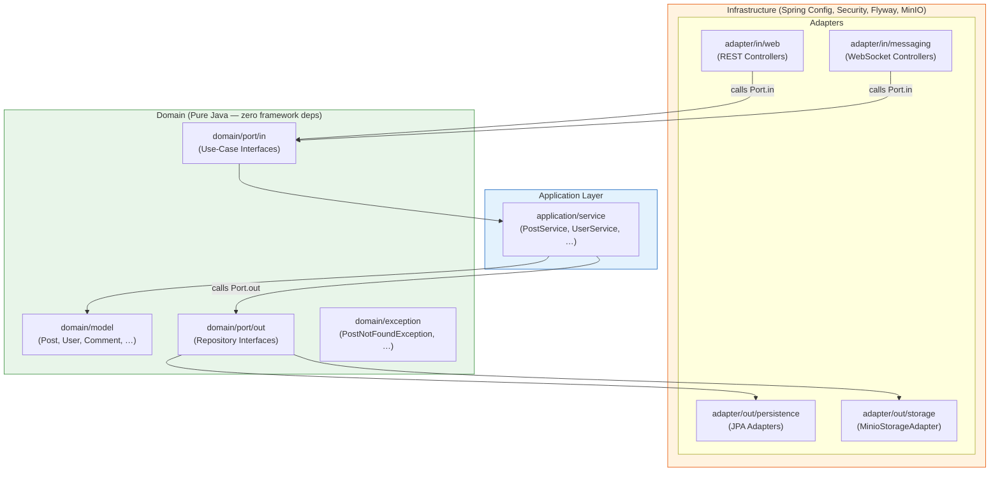
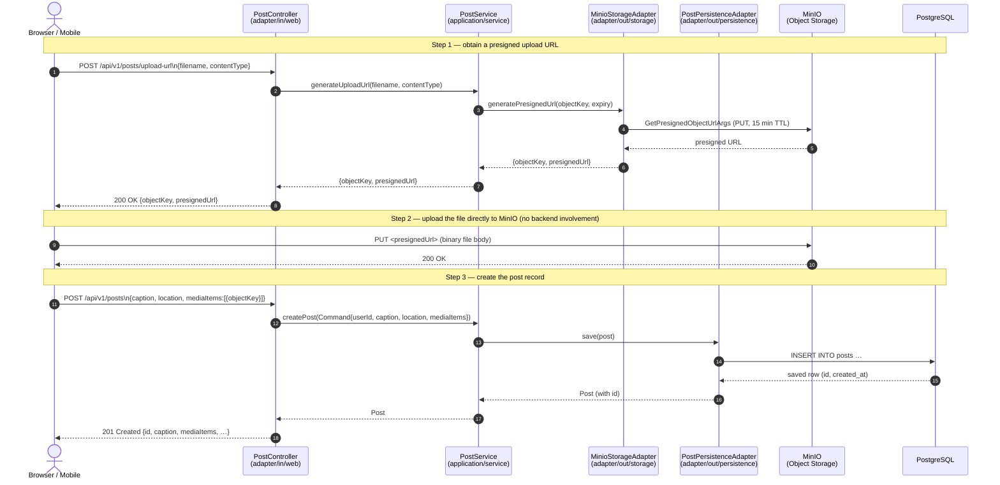
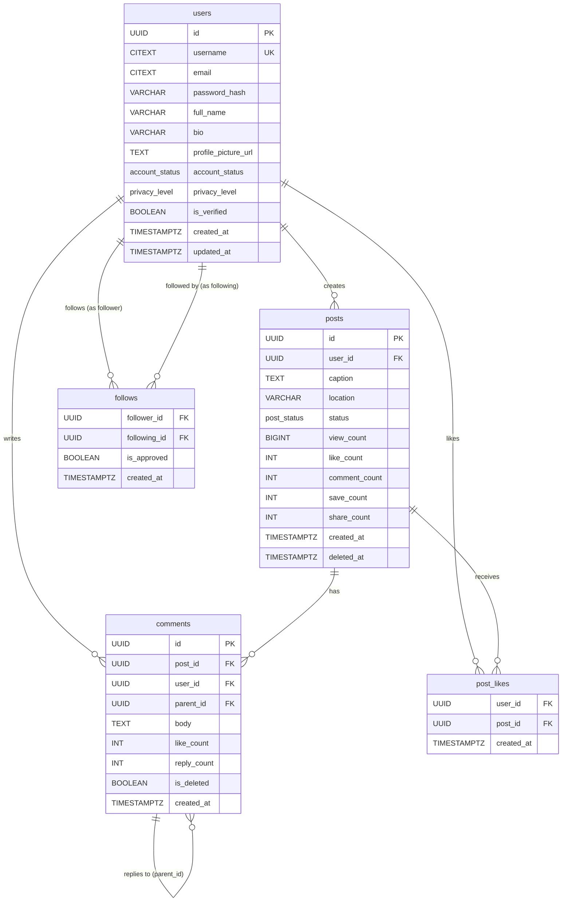
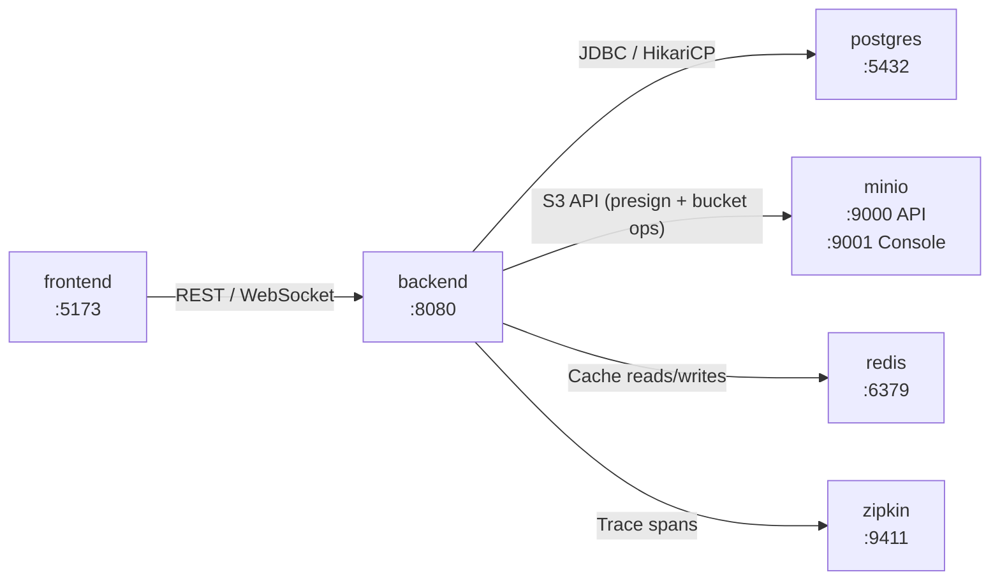

# TASK-10.50 — Architecture & flow diagrams (Mermaid)

## Overview

Create `docs/diagrams.md` containing three Mermaid diagrams: a hexagonal-architecture `flowchart`, a create-post `sequenceDiagram`, and an `erDiagram` for the core data model. All diagrams must render in GitHub's built-in Markdown preview without syntax errors. Because Mermaid diagrams are plain text, they live in git, diff cleanly, and never go stale in the way that exported PNG screenshots do.

This task produces documentation only — no source code is modified.

---

## Level

Core · Pairs with [TASK-10.49 — Troubleshooting runbook](TASK-10.49-troubleshooting-runbook.md) and [TASK-10.46 — Full docker-compose.yml](TASK-10.46-docker-compose.md)

---

## Why

The hexagonal layering and request flows currently exist only in prose inside `context/project-overview.md`. A diagram makes the structure visible at a glance: a new contributor can see in ten seconds that controllers never touch the database directly, and that the domain model never imports Spring. Sequence diagrams make the create-post flow concrete — especially the MinIO presign hop, which surprises people when they first encounter it. Because Mermaid is plain text checked into git, diagrams are reviewed in pull requests and updated alongside the code they describe, unlike images that can silently fall out of date.

---

## Prerequisites

- Read `context/project-overview.md` — the ASCII architecture diagram there is the source of truth for layer names and package layout.
- Read `docs/database/schema.sql` — the `erDiagram` is derived directly from the `users`, `posts`, `comments`, `post_likes`, and `follows` table definitions. Do not invent columns.
- A Mermaid-capable Markdown preview: either push the file to GitHub (which renders Mermaid natively since 2022), or install the [Mermaid Preview](https://marketplace.visualstudio.com/items?itemName=bierner.markdown-mermaid) VS Code extension.
- **Concepts to skim:**
  - **Mermaid** — a text-to-diagram language embedded in Markdown code fences tagged ` ```mermaid `. Full syntax reference: [mermaid.js.org](https://mermaid.js.org/intro/).
  - **`flowchart LR` / `TD`** — `LR` = left-to-right arrows, `TD` = top-down. For the hexagonal diagram, `TD` (top-down) matches the mental model of dependencies pointing inward.
  - **`sequenceDiagram`** — shows actors and the messages they exchange in time order. Participants are declared at the top; arrows use `->>`  (solid) or `-->>`  (dashed/return).
  - **`erDiagram`** — entity-relationship diagram. Relationships use cardinality notation: `||--o{` means "one-to-zero-or-many".

---

## Files to Create / Modify

```
docs/diagrams.md                             (new)
README.md                                    (modify — add link to docs/diagrams.md)
```

---

## Step-by-Step

### 1. Create `docs/diagrams.md` with a header

Create the file at `docs/diagrams.md` and add the following opening:

```markdown
# Architecture & Flow Diagrams

All diagrams are written in [Mermaid](https://mermaid.js.org/) and render natively on GitHub.
To preview locally, install the
[Markdown Preview Mermaid Support](https://marketplace.visualstudio.com/items?itemName=bierner.markdown-mermaid)
VS Code extension.

---
```

### 2. Add the hexagonal architecture `flowchart`

This diagram shows how dependencies flow inward — the domain is in the centre and knows nothing about Spring, JPA, or HTTP. Copy and paste the block below into `docs/diagrams.md`:

````markdown
## Hexagonal Architecture — Dependency Flow

Arrows point from outer layers **toward** the domain. Nothing in the domain imports anything from the layers above it.


````

### 3. Add the create-post `sequenceDiagram`

This diagram traces a single `POST /api/v1/posts` request from the HTTP client all the way to Postgres, including the MinIO presign hop that happens before the HTTP body is sent. Copy and paste the block below:

````markdown
## Create Post — End-to-End Request Flow

This sequence covers two HTTP calls: the presign-URL request and the actual post-creation request.


````

### 4. Add the core data model `erDiagram`

The column names and relationships below are sourced directly from `docs/database/schema.sql`. Do not add columns that do not exist in the schema.

````markdown
## Core Data Model — Entity Relationships

Key columns only; full DDL is in `docs/database/schema.sql`.


````

### 5. (Optional) Add a Docker Compose deployment `flowchart`

If [TASK-10.46](TASK-10.46-docker-compose.md) has been completed, add a diagram showing which Docker services exist and how they connect. Use the actual services from `docker-compose.yml` (`postgres`, `minio`, `redis`) plus the services planned in TASK-10.46 (`backend`, `frontend`, `zipkin`).

````markdown
## Docker Compose — Service Topology (TASK-10.46)


````

### 6. Link `docs/diagrams.md` from `README.md`

The README already links to `docs/troubleshooting.md` from TASK-10.49. Add or update the documentation table:

```markdown
## Documentation

| Doc | Description |
|-----|-------------|
| [docs/troubleshooting.md](docs/troubleshooting.md) | Symptom → Cause → Fix for common local-dev failures |
| [docs/diagrams.md](docs/diagrams.md) | Architecture and data-model diagrams (Mermaid) |
| [docs/plan.md](docs/plan.md) | Phased development roadmap |
```

### 7. Verify every diagram renders on GitHub

Push the branch to GitHub (or use the GitHub web editor to preview). Open `docs/diagrams.md` in the GitHub file viewer. All Mermaid blocks must render as images, not as raw text. If a block renders as raw text, there is a syntax error — GitHub will not report the error location, so paste the block into the live editor at [mermaid.live](https://mermaid.live) to find it.

---

## Checklist

- [ ] Add a `flowchart` of the hexagonal layers (`infrastructure → adapter → application → domain`) with dependency arrows pointing inward
- [ ] Add a `sequenceDiagram` for one end-to-end request (create post: `Controller → UseCase → PersistenceAdapter → Postgres`, including the MinIO presign hop)
- [ ] Add an `erDiagram` for the core tables (`users`, `posts`, `comments`, `post_likes`, `follows`) with relationships and key columns sourced from `docs/database/schema.sql`
- [ ] (Optional) Add a deployment `flowchart` of the Docker Compose services (TASK-10.46): frontend, backend, postgres, redis, minio, zipkin
- [ ] Confirm every diagram renders in the GitHub markdown preview and link `docs/diagrams.md` from the README

---

## How to Verify

**1. File exists**

```powershell
Test-Path docs/diagrams.md
```

Expected: `True`

**2. All three required diagram types are present**

```powershell
$content = Get-Content docs/diagrams.md -Raw
@("flowchart", "sequenceDiagram", "erDiagram") | ForEach-Object {
    if ($content -match $_) { Write-Host "FOUND: $_" } else { Write-Host "MISSING: $_" }
}
```

Expected: three `FOUND` lines.

**3. ER diagram column names match schema.sql (spot-check)**

```powershell
# Check that no invented column name slipped in
$diagramCols = (Get-Content docs/diagrams.md | Select-String "like_count|follower_id|is_approved|parent_id|is_deleted")
$diagramCols
```

Each column printed should have a matching definition in `docs/database/schema.sql`.

**4. Render check — paste one diagram into mermaid.live**

Copy the `flowchart TD` block (Steps 2 above) and paste it into [https://mermaid.live](https://mermaid.live). The diagram must render without a red error banner.

**5. GitHub render check**

Push to a branch and open `docs/diagrams.md` on GitHub. Each ` ```mermaid ` block must display as a rendered image.

**Passing result:** All three diagrams render as images (not code blocks) in the GitHub Markdown preview. The ER diagram columns exactly match the schema. The README contains a working link to `docs/diagrams.md`.

---

## Notes / Gotchas

**"GitHub renders the block as a code fence, not a diagram."**
GitHub's Mermaid support requires the fence to be exactly ` ```mermaid ` (lowercase, no spaces). A common mistake is ` ```Mermaid ` or ` ``` mermaid `.

**"The `erDiagram` has a relationship arrow error."**
Mermaid's ER notation is strict. The pattern is:
```
EntityA cardinality--cardinality EntityB : "label"
```
Valid cardinality tokens: `||` (exactly one), `o|` (zero or one), `||` (one), `o{` (zero or many), `|{` (one or many). Example: `users ||--o{ posts : "creates"`.

**"The `sequenceDiagram` arrow types look odd."**
Use `-->>` for return messages (dashed) and `->>` for calls (solid). Avoid `->` (non-arrow) in sequence diagrams — it renders as a thin open line, which looks like the same weight as a return.

**"The `flowchart` subgraph labels have spaces — do I need quotes?"**
Yes. Any subgraph ID or label that contains spaces or special characters must be quoted:
```
subgraph Infrastructure ["Infrastructure (Spring Config, Security, …)"]
```

**"I edited the diagram and GitHub still shows the old version."**
GitHub caches rendered Markdown. Append `?plain=1` to the URL to see raw source, or wait a minute and hard-refresh.

**Do not screenshot Mermaid diagrams and commit the PNG.**
Exported PNGs cannot be diffed or reviewed. Mermaid source text in the Markdown file is the single source of truth. If someone asks for a PNG (e.g. for a slide deck), export it on demand from [mermaid.live](https://mermaid.live) — do not commit it.

**Reference docs:**
- [Mermaid — Getting Started](https://mermaid.js.org/intro/)
- [Mermaid — Flowchart syntax](https://mermaid.js.org/syntax/flowchart.html)
- [Mermaid — Sequence Diagram syntax](https://mermaid.js.org/syntax/sequenceDiagram.html)
- [Mermaid — Entity Relationship Diagram](https://mermaid.js.org/syntax/entityRelationshipDiagram.html)
- [GitHub — Mermaid rendering announcement](https://github.blog/developer-skills/github/include-diagrams-markdown-files-mermaid/)

**Related tasks:**
- [TASK-10.49](TASK-10.49-troubleshooting-runbook.md) — both docs files are linked from README together
- [TASK-10.46](TASK-10.46-docker-compose.md) — the optional deployment flowchart shows the services defined there
- [TASK-10.38](TASK-10.38-archunit-fitness-tests.md) — ArchUnit enforces the dependency rules shown in the hexagonal flowchart as automated tests
